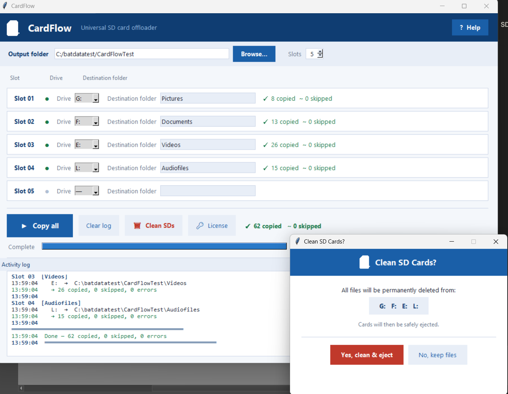

# 💾 CardFlow — Multi-SD Card Offloader for Windows

**Copy up to 16 SD cards simultaneously into organised, named folders.**  
Built for photographers, ecologists, filmmakers, drone operators, and anyone who regularly handles large volumes of SD cards.



---

## What it does

CardFlow removes the tedious part of field data management. Insert your cards, name the destination folders, and press Copy. Everything lands where it should — no manual file moving, no duplicates, no mess.

- **Up to 16 SD cards at once** — each card gets its own destination folder
- **Auto-detects newly inserted cards** — assigns them to a slot within 2 seconds
- **All file types supported** — works with any device that stores files on SD: cameras, drones, recorders, sensors
- **Safe re-runs** — files already at the destination are skipped, no duplicates ever created
- **Preserves folder structure** — the original layout on the card is kept intact
- **Clean & eject after copy** — wipes and safely ejects all cards after a confirmed perfect copy (two-step confirmation)
- **Activity log** — every copy operation is logged with timestamps

---

## How it works

```
1. Insert your SD cards   →   CardFlow detects them automatically
2. Name each folder       →   type a destination name per slot
3. Choose output folder   →   select where files should land
4. Press Copy             →   done
```

---

## Download

**[⬇ Download CardFlow 1.0 for Windows](CardFlow1.0.exe)**

> A **license key** is required to activate. The app is free to download.

---

## Pricing & Licensing

| Option | Price |
|---|---|
| 1-year license | €19.99 |
| Free 3-day trial | Free — email to request |

**[🔑 Get a license key on Gumroad](https://casvansichem.gumroad.com/l/CardFlow)**

The license clock starts the day you activate — not the day you buy.  
To request a free 3-day trial key, email **casvansichem@icloud.com**.

---

## Who is it for?

CardFlow was developed during an internship at [NIOO-KNAW](https://www.nioo.knaw.nl) to solve a real problem: piles of SD cards from field deployments needing to be copied and organised quickly. It's useful for anyone in a similar situation:

- 🦉 Wildlife researchers & ecologists (camera traps, acoustic sensors)
- 📷 Photographers (events, wildlife, sports)
- 🎬 Filmmakers & videographers
- 🚁 Drone operators
- 🔬 Field scientists with remote sensor deployments

---

## System requirements

- Windows 10 or 11
- No installation required — single `.exe` file
- An SD card reader or USB hub with multiple slots

---

## Contact

Questions, feedback, or trial requests:  
📧 **casvansichem@icloud.com**

---

*CardFlow is commercial software. The executable is provided for download and evaluation. A valid license key is required for continued use.*
